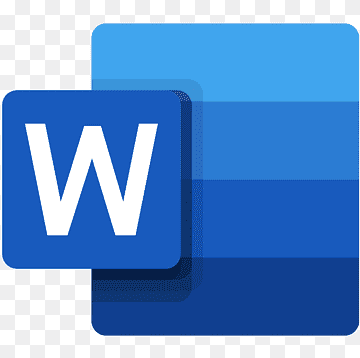
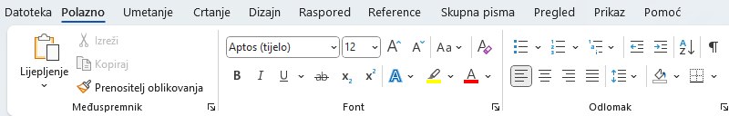
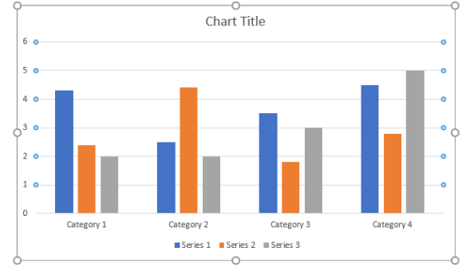
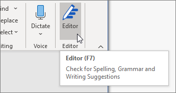

# Microsoft Word - Osnovne funkcije
{ width=500px height=200px }
 
---

# Microsoft Word
- Jedan od najpopularnijih alata za obradu teksta i izradu dokumenata
- Razvijen od starne Microsofta i dio je Office paketa
- Može se koristiti kao zasebni program

---
# Povijest Worda
- Prvo izdanje: 1983. godine.
- Postao ključni alat za poslovnu i osobnu upotrebu.
- Stalno se ažurira s novim značajkama.

---

# Primjena Microsoft Worda
- Koristi se za izradu dokumenata poput:
  - Pisama
  - Izvještaja
  - Životopisa
  - I mnogih drugih dokumenata
  

---

# Glavne značajke Microsoft Worda
- **Formatiranje teksta** (fontovi, veličine, boje).
- **Umetanje slika i tablica**.
- **Stvaranje zaglavlja i podnožja**.
- Alati za provjeru pravopisa i gramatike.

---

# Alati za uređivanje teksta
- Promjena fonta, veličine i stila
- Poravnjavanje teksta: lijevo, centrirano, desno ili obostrano
- Numeriranje ili označavanje: dodavanje popisa s brojevima ili oznakama

---

# Rad s dokumentima
- Otvaranje, spremanje i dijeljenje dokumenata.
- Podrška za više formata (DOCX, PDF, itd.).
- Suradnja u stvarnom vremenu putem OneDrive-a.
---

# Umetanje elemenata
- **Slike i grafikoni**: dodavanje vizualnih elemenata
- **Tablice**: organizacija podataka u redove i stupce
- **Linkovi**: umetanje poveznica 

---

# Alati za provjeru
- Automatsko otkrivanje pravopisnih i gramatičkih pogrešaka
- Pretraživanje i izmjena: brzo pronalaženje i izmjena teksta kraticama CTRL + F i CTRL + H

---

# Suradnja i sigurnost

- **Praćenje promjena** i komentari.
- Zaštita dokumenata lozinkom.
- Podrška za suradnju putem oblaka.

---

# Prednosti i nedostaci Microsoft Worda

## Prednosti
- Intuitivno sučelje za korisnike svih razina.
- Bogate značajke za formatiranje i obradu teksta.
- Široka kompatibilnost s raznim formatima datoteka.
- Integracija s Microsoft Office paketom i OneDrive-om.
- Redovita ažuriranja i poboljšanja.

## Nedostaci
- Cijena: nije besplatan softver.
- Kompleksnost za početnike zbog brojnih opcija.
- Ponekad zahtjeva puno memorije i resursa računala.
- Ograničena prilagodba u usporedbi s nekim open-source alatima.
---

# Zaključak

Microsoft Word je moćan alat za obradu teksta koji pruža bogat skup značajki za osobnu, poslovnu i akademsku upotrebu.
---
